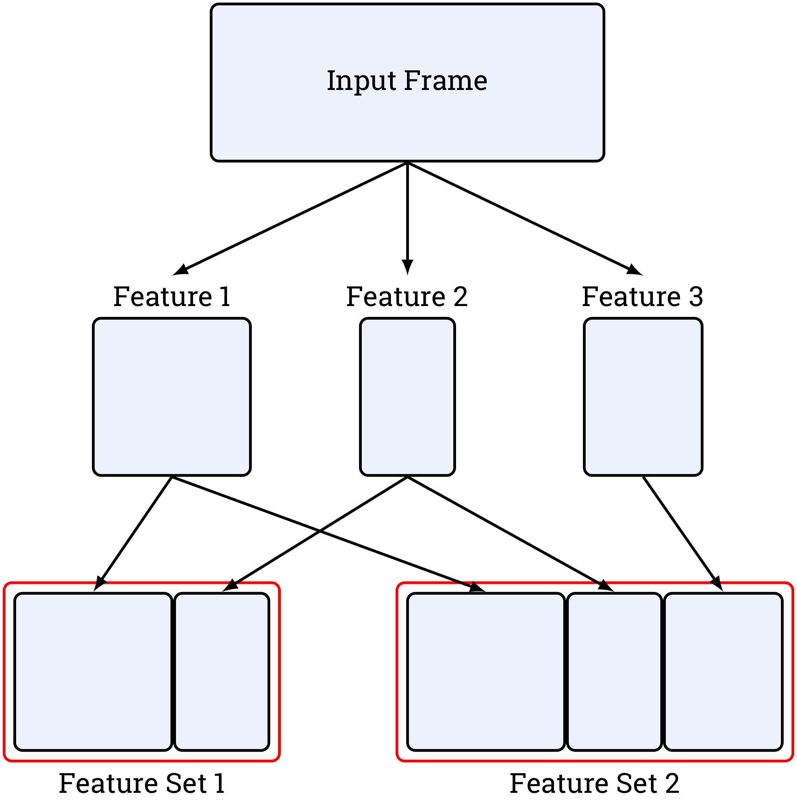
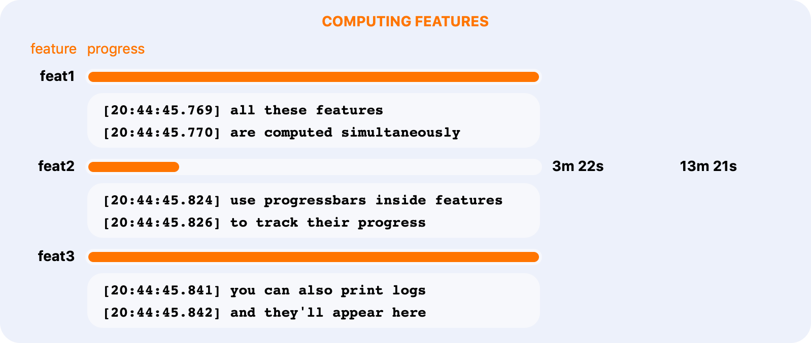
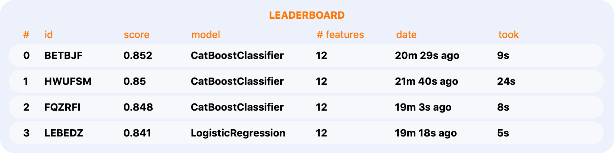
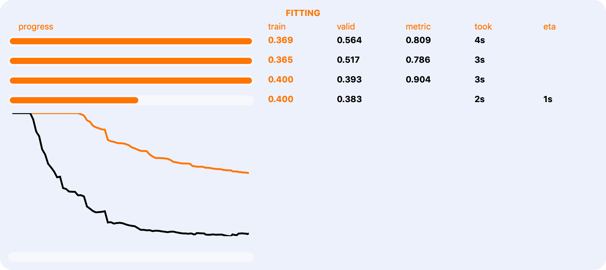
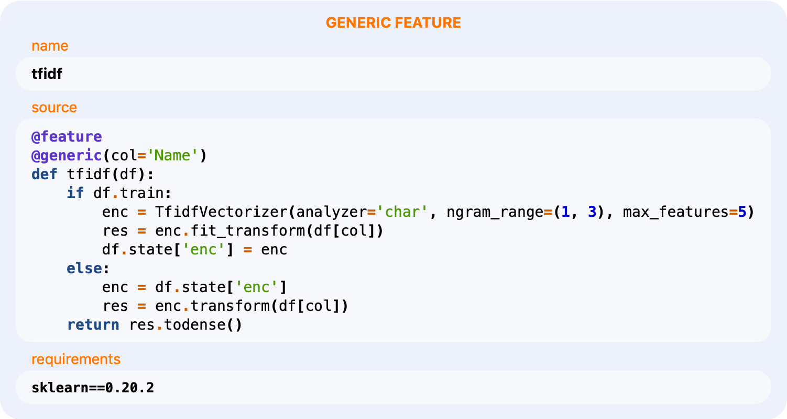

# Overview

## Modular Feature Engineering



## Features

### Parallel Feature Computing



### Experiment Tracking



### Rich Reports




### Source Code Tracking



### Caching

### Easy Stacking

### Safe Validation

### End-to-end Experiment Inference

```python
experiment.predict(test_frame)
```

## Clean API

```python
@feature
def some_feature(df):
    res = stl.empty_like(df)
    res['c'] = df['a'] - df['b']
    res['d'] = df['a'] * df['b']
    return res
   
@feature(cache=False)
def other_feature(df):
    res = stl.empty_like(df)
    res['p'] = df['q'] - df['q'].mean()
    return res 
    
fs = FeatureSet([some_feature, other_feature], 
                train_frame=train,
                targets='Survived')
```



```python
from kts.models import binary

model = binary.CatBoostClassifier(rsm=0.2)
```



```python
from sklearn.metrics import roc_auc_score
from sklearn.model_selection import StratifiedKFold

skf = StratifiedKFold(5, True, 42)
val = Validator(skf, roc_auc_score)

summary = val.score(model, fs)
exp_id = summary['id']
```



```python
val_splitter = ...
val_stack = Validator(val_splitter, roc_auc_score)

model_stack = binary.LogisticRegression(C=10)
fs_stack = FeatureSet([..., stl.stack(exp_id)], ...)

summary_stack = val_stack.score(model_stack, fs_stack)
stack_id = summary_stack['id']
```



```python
model = leaderboard[exp_id]
model_stack = leaderboard[stack_id]

model.predict(test_frame)
model_stack.predict(test_frame)
```

